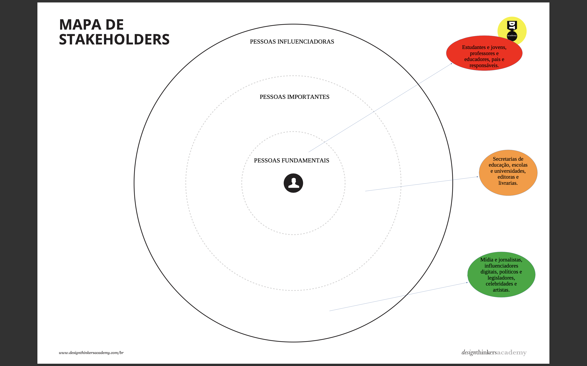
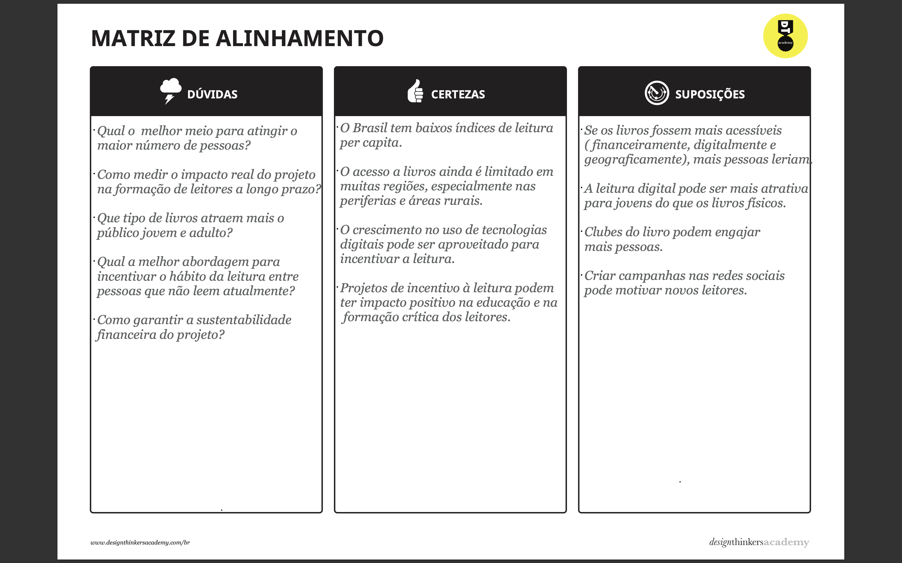
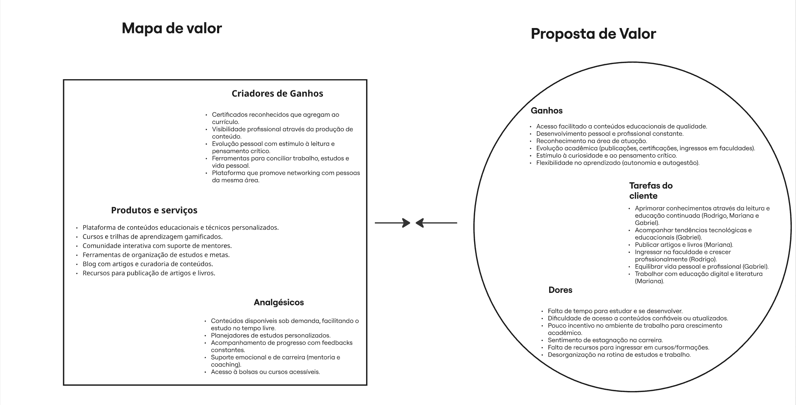
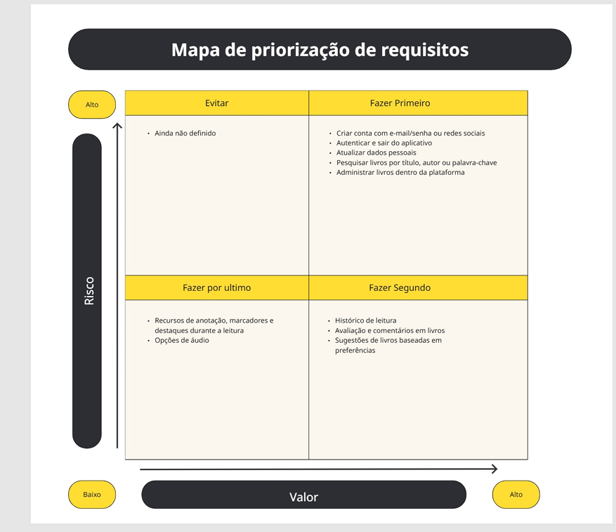
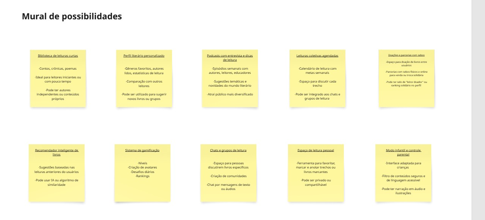

# Especificações Do Projeto

Pré-requisitos: <a href="1-Contexto.md"> Documentação de Contexto</a>

> Apresente uma visão geral do que será abordado nesta parte do
> documento, enumerando as técnicas e/ou ferramentas utilizadas para
> realizar a especificações do projeto

## Mapa de Stakeholders
 

## Matriz de Alinhamento
 

## Diagramas de Personas
 

## Mapa de Priorização
 

## Mural de Possibilidades
 

## Personas

 

Rodrigo tem 23 anos, é auxiliar administrativo e usa seus momentos livres — como o trajeto para o trabalho — para mergulhar em conteúdos digitais através do <em>smartphone</em>. Apaixonado por ficção científica, quadrinhos e <em>podcasts</em>, ele é introvertido, curioso e determinado. Rodrigo sonha em aprofundar seu conhecimento, melhorar sua comunicação e ingressar na faculdade. Para ele, uma plataforma ideal deve ser acessível, sem burocracia, alinhada aos seus interesses e oferecer incentivos para manter o hábito da leitura. Complexidade, falta de acessibilidade e limitações sem motivo afastariam Rodrigo da experiência desejada.

 

Aos 32 anos, Mariana é professora de literatura e pesquisadora em educação digital. Apaixonada por ler artigos sobre literatura e tecnologia, ela utiliza dispositivos como <em>tablets</em> e <em>smartphones</em> para se manter atualizada e organizada em seus estudos. Intelectual e curiosa, Mariana sonha em publicar um livro e transformar a educação com o uso da tecnologia. Para se conectar com ela, é essencial oferecer suporte empático, respeitar sua trajetória acadêmica e garantir acesso acessível e bem estruturado ao conteúdo. Mariana valoriza transparência, organização e inovação — e se afasta de experiências confusas ou que desvalorizem a educação.

 

Gabriel tem 27 anos, é estudante de pós-graduação em Ciência da Informação e também atua como analista de TI. Ele gosta de escrever sobre tecnologia e educação, além de fotografar bibliotecas e ambientes acadêmicos. Com uma personalidade analítica, empática e inclusiva, Gabriel busca equilibrar sua vida profissional e pessoal enquanto contribui com a evolução da educação tecnológica. Para ele, o acesso a conteúdo relevante, colaboração e valorização do progresso acadêmico são fundamentais. Plataformas que ignoram a troca de ideias ou impõem soluções sem base técnica não têm espaço no seu dia a dia.

> Enumere e detalhe as personas da sua solução. Para
> tanto, baseie-se tanto nos documentos disponibilizados na disciplina
> e/ou nos seguintes links:
>
> **Links Úteis**:
> - [Rock Content](https://rockcontent.com/blog/personas/)
> - [Hotmart](https://blog.hotmart.com/pt-br/como-criar-persona-negocio/)
> - [O que é persona?](https://resultadosdigitais.com.br/blog/persona-o-que-e/)
> - [Persona x Público-alvo](https://flammo.com.br/blog/persona-e-publico-alvo-qual-a-diferenca/)
> - [Mapa de Empatia](https://resultadosdigitais.com.br/blog/mapa-da-empatia/)
> - [Mapa de Stalkeholders](https://www.racecomunicacao.com.br/blog/como-fazer-o-mapeamento-de-stakeholders/)
>
> Lembre-se que você deve ser enumerar e descrever precisamente e
> personalizada todos os clientes ideais que sua solução almeja.

## Histórias de Usuários

Com base na análise das personas forma identificadas as seguintes histórias de usuários:

|EU COMO... `PERSONA`| QUERO/PRECISO ... `FUNCIONALIDADE` |PARA ... `MOTIVO/VALOR`                 |
|--------------------|------------------------------------|----------------------------------------|
|Estudante   | Ter acesso rápido a uma grande variedade de conteúdos e fontes confiáveis | Ter facilidade de acesso em pesquisas acadêmicas|
|Professor   | Publicar livros e artigos  | Transformar a educação através da tecnologia.  |
|Rodrigo Duarte | Aprofundar seu conhecimento através da leitura | Melhorar sua comunicação e ingressar na faculdade  |
|Investidor  | Opinar sucintamente sobre o apoio financeiro em caso de projeto sem fins lucrativos       | Investir na Educação do Brasil  |

>
> **Links Úteis**:
> - [Histórias de usuários com exemplos e template](https://www.atlassian.com/br/agile/project-management/user-stories)
> - [Como escrever boas histórias de usuário (User Stories)](https://medium.com/vertice/como-escrever-boas-users-stories-hist%C3%B3rias-de-usu%C3%A1rios-b29c75043fac)

## Requisitos

As tabelas que se seguem apresentam os requisitos funcionais e não funcionais que detalham o escopo do projeto.

### Requisitos Funcionais

|ID    | Descrição do Requisito  | Prioridade |
|------|-----------------------------------------|----|
|RF-001| Criar conta via e-mail/senha ou redes sociais| ALTA | 
|RF-002| O usuário deve poder logar e deslogar da plataforma| MÉDIA |
|RF-003| O usuário deve poder atualizar seus dados pessoais| MÉDIA |
|RF-004| O usuário deve poder visualizar seu histórico de leituras| MÉDIA |
|RF-005| O usuário deve poder pesquisar livros por título, autor ou palavra-chave| MÉDIA |
|RF-006| O usuário deve poder avaliar e comentar nos livros| MÉDIA |
|RF-007| O aplicativo deve sugerir livros com base na preferência e no histórico de leitura| MÉDIA |
|RF-008| O aplicativo deve oferecer marcadores, anotações e destaques durante a leitura| MÉDIA |

### Requisitos não Funcionais

|ID     | Descrição do Requisito  |Prioridade |
|-------|-------------------------|----|
|RNF-001| O aplicativo deve suportar uma grande massa de usuários simultâneos| ALTA | 
|RNF-002| O aplicativo deve ter uma interface intuitiva, amistosa e responsividade| CRÍTICA | 
|RNF-003| O aplicativo deve ter compatibilidade com múltiplas plataformas (Web, android, iOS)|  ALTA |
|RNF-004| Política de privacidade clara sobre o uso de dados pessoais| ALTA |
|RNF-005| Carregamento rápido das páginas, especialmente para usuários com internet lenta|  ALTA |
|RNF-006| Código com documentação e notas para futuras melhorias/manutenção| ALTA |
|RNF-007| Direitos autorais preservados ao exibir trechos e resenhas de livros| CRÍTICA |
|RNF-008| Opções de áudio para resumos de livros ou recomendações.| ALTA |

> Com base nas Histórias de Usuário, enumere os requisitos da sua
> solução. Classifique esses requisitos em dois grupos:
>
> - [Requisitos Funcionais
>   (RF)](https://pt.wikipedia.org/wiki/Requisito_funcional):
>   correspondem a uma funcionalidade que deve estar presente na
>   plataforma (ex: cadastro de usuário).
>
> - [Requisitos Não Funcionais
>   (RNF)](https://pt.wikipedia.org/wiki/Requisito_n%C3%A3o_funcional):
>   correspondem a uma característica técnica, seja de usabilidade,
>   desempenho, confiabilidade, segurança ou outro (ex: suporte a
>   dispositivos iOS e Android).
>
> Lembre-se que cada requisito deve corresponder à uma e somente uma
> característica alvo da sua solução. Além disso, certifique-se de que
> todos os aspectos capturados nas Histórias de Usuário foram cobertos.

## Restrições

O projeto está restrito pelos itens apresentados na tabela a seguir.

|ID| Restrição                                             |
|--|-------------------------------------------------------|
|01| O projeto deverá ser entregue até o final do semestre |
|02| Não pode ser desenvolvido um módulo de backend        |

> Enumere as restrições à sua solução. Lembre-se de que as restrições
> geralmente limitam a solução candidata.
> 
> **Links Úteis**:
> - [O que são Requisitos Funcionais e Requisitos Não Funcionais?](https://codificar.com.br/requisitos-funcionais-nao-funcionais/)
> - [O que são requisitos funcionais e requisitos não funcionais?](https://analisederequisitos.com.br/requisitos-funcionais-e-requisitos-nao-funcionais-o-que-sao/)
