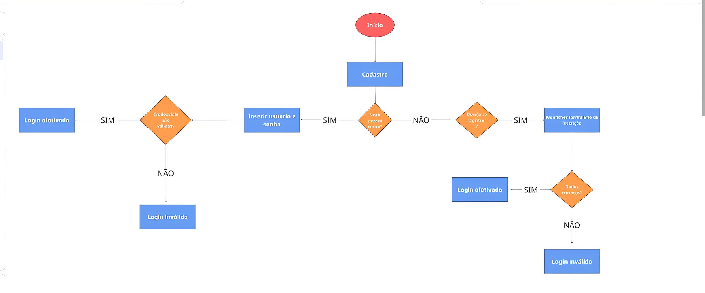
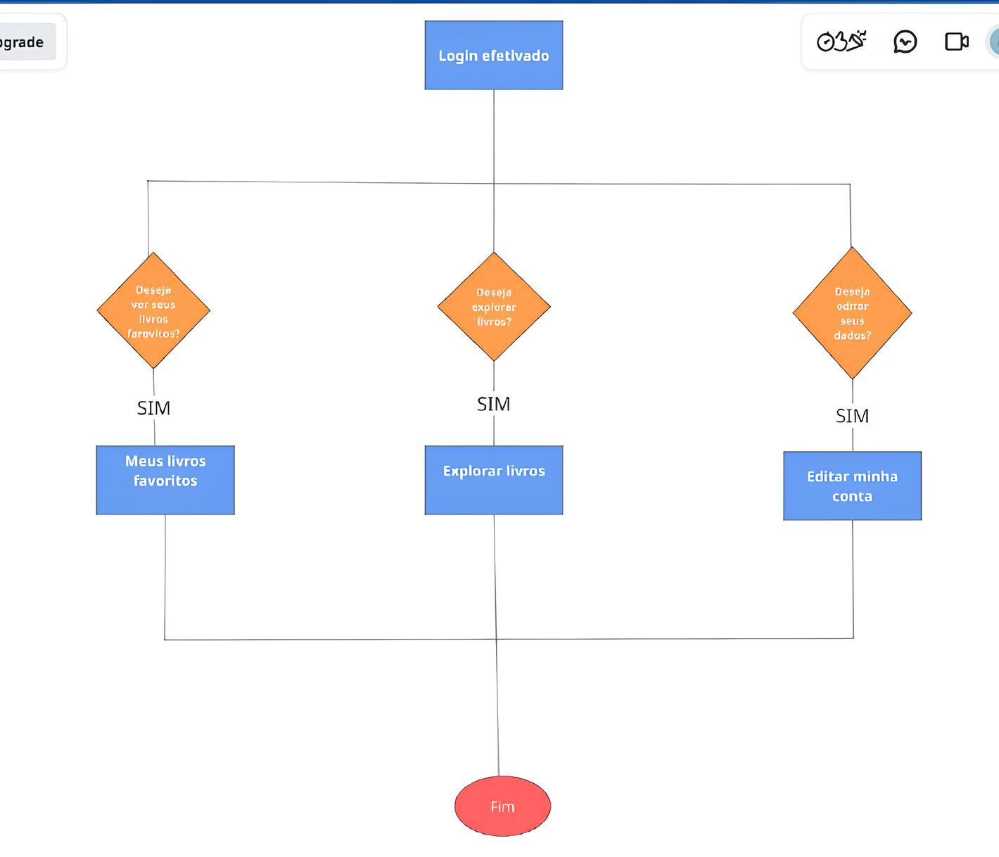
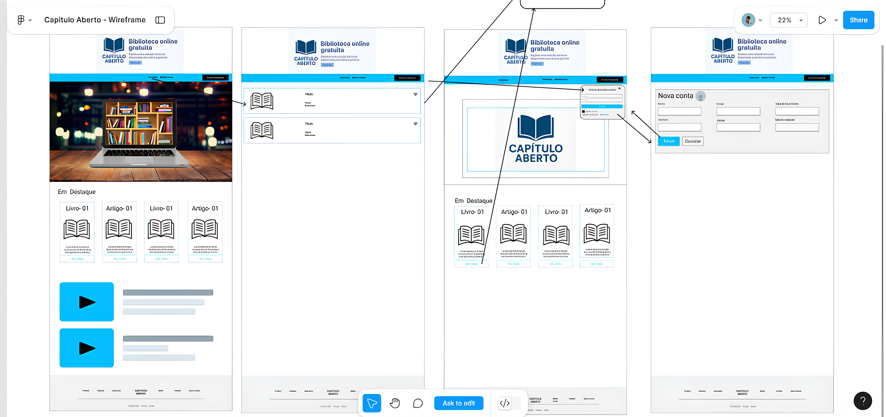
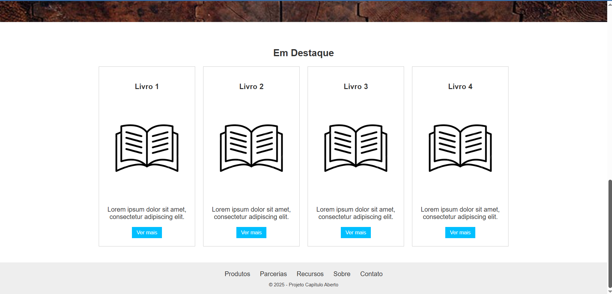
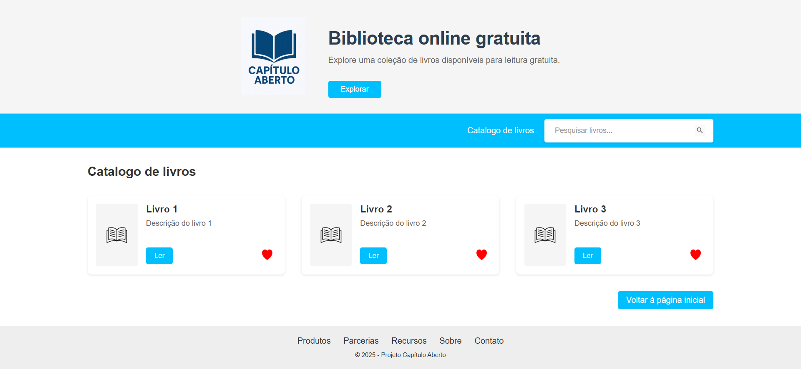

# Projeto de Interface

Pré-requisitos: <a href="2-Especificação.md"> Documentação de Especificação</a>

> Apresente as principais a interface da plataforma. Discuta como ela
> foi elaborada de forma a atender os requisitos funcionais, não
> funcionais e histórias de usuário abordados nas [Especificações do
> Projeto](2-Especificação.md).

## Fluxo do Usuário

## Wireframes

## Prints do Protótipo Interativo

> **Links Úteis**:
> - [Repositório do Protótipo Interativo](https://github.com/Leafar8/prototipo_capitulo_aberto.git)

