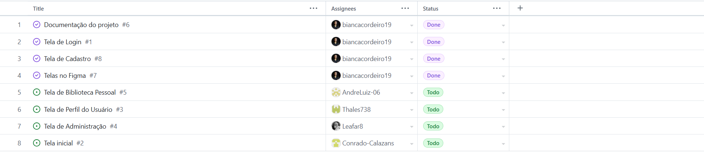
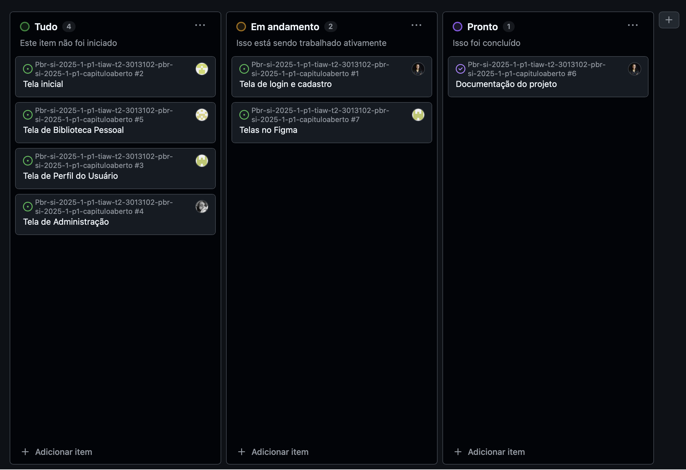

# Planejamento do Projeto

> Aqui será feito o gerenciamento das tarefas de implementação do projeto.

## Divisão de Papéis

  
### Sprint 1
- _Scrum master_: Bianca Larisse Cordeiro de Moura
- Protótipos: AlunoY
- Desenvolvedor _front-end_: Conrado Calazans
- Testes: Todos participantes testaram as aplicações.
- Documentação: Bianca Larisse Cordeiro de Moura, Conrado Calazans

### Sprint 2
- _Scrum master_: Bianca Larisse Cordeiro de Moura
- Desenvolvedor _front-end_: Conrado Calazans, Thales Cauã Martins, Rafael Franklin
- Desenvolvedor _back-end_: Bianca Larisse Cordeiro de Moura
- Testes: Todos participantes testaram as aplicações.
- 
### Sprint 3
- _Scrum master_: Bianca Larisse Cordeiro de Moura
- Desenvolvedor _front-end_: Thales Cauã Martins 
- Desenvolvedor _back-end_: AlunoK
- Testes: AlunaZ

  
## Quadro de tarefas

## Sprint 1

Atualizado em: 21/04/2024

| Responsável   | Tarefa/Requisito | Iniciado em    | Prazo      | Status | Terminado em    |
| :----         |    :----         |      :----:    | :----:     | :----: | :----:          |
| Bianca Larisse Cordeiro de Moura        | Introdução | 01/02/2024     | 07/02/2024 | ✔️    | 18/04/2025      |
| Bianca Larisse Cordeiro de Moura        | Objetivos    | 03/02/2024     | 10/02/2024 | ✔️    |  18/04/2025  |
| Conrado Calazans de Souza  | Catálogo de Livros  | 25/04/2025     | 27/042025 | ✔️     |  27/04/2025   |
| AlunoK        | Personas 1  |    01/01/2024        | 12/02/2005 | ❌    |       |

## Sprint 2

Atualizado em: 21/04/2024

| Responsável   | Tarefa/Requisito | Iniciado em    | Prazo      | Status | Terminado em    |
| :----         |    :----         |      :----:    | :----:     | :----: | :----:          |
| AlunaX        | Home-Page        | 01/02/2024     | 07/03/2024 | ✔️    | 05/01/2005      |
| AlunaZ        | CSS Unificado    | 03/02/2024     | 10/03/2024 | 📝    |                 |
| Bianca Larisse Cordeiro de Moura        | Página de login  | 01/02/2024     | 07/03/2024 | 📝     |                 |
| AlunoK        | Script de login  |  01/01/2024    | 12/03/2024 | ❌    |       |

## Sprint 3

Atualizado em: 21/04/2024

| Responsável   | Tarefa/Requisito | Iniciado em    | Prazo      | Status | Terminado em    |
| :----         |    :----         |      :----:    | :----:     | :----: | :----:          |
| Bianca Larisse Cordeiro de Moura        | Introdução | 01/02/2024     | 07/02/2024 | ✔️    | 18/04/2025      |
| Bianca Larisse Cordeiro de Moura        | Objetivos    | 03/02/2024     | 10/02/2024 | ✔️    | 18/04/2025   |
| AlunoY        | Histórias de usuário  | 01/01/2024     | 07/01/2005 | ⌛     |                 |
| AlunoK        | Personas 1  |    01/01/2024        | 12/02/2005 | ❌    |       |

Legenda:
- ✔️: terminado
- 📝: em execução
- ⌛: atrasado
- ❌: não iniciado

## Ferramentas

> Liste quais ferramentas foram empregadas no desenvolvimento do  projeto, justificando a escolha de cada uma delas. Use o formato abaixo como exemplo.

As ferramentas empregadas no projeto são:

- Editor de código.
- Ferramentas de diagramação.
- <em>Frameworks</em> 
- Outras ferramentas externas

## Links Úteis
> - [11 Passos Essenciais para Implantar Scrum no seu Projeto](https://mindmaster.com.br/scrum-11-passos/)
> - [Scrum em 9 minutos](https://www.youtube.com/watch?v=XfvQWnRgxG0)

