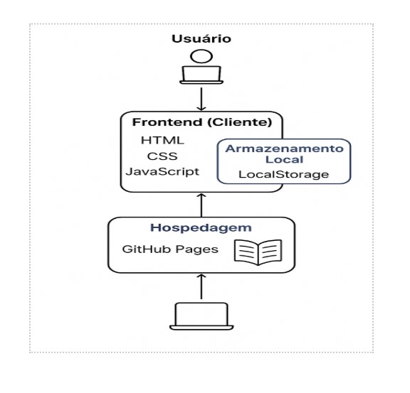

# Projeto da Solução

A solução proposta consiste no desenvolvimento de uma plataforma digital de biblioteca <em>online</em>, acessível via navegador e dispositivos móveis, que permitirá aos usuários visualizar, organizar e acompanhar suas leituras de forma prática, gratuita e personalizada. A plataforma será construída com foco em usabilidade, acessibilidade e escalabilidade, permitindo o crescimento do acervo e o envolvimento de uma comunidade leitora.

A proposta contempla não apenas a disponibilização dos livros, mas também funcionalidades que otimizem a experiência do usuário, como categorização de obras, progresso de leitura, sugestões personalizadas com base em preferências e recursos de organização pessoal.

Pré-requisitos: <a href="4-Gestão-Configuração.md"> Ambiente e Ferramentas de Trabalho</a>

## Tecnologias Utilizadas

Para o desenvolvimento da biblioteca <em>online</em> com livros gratuitos, serão utilizadas tecnologias <em>web</em> amplamente conhecidas, de fácil manutenção e com grande suporte da comunidade. A seguir, estão listadas todas as tecnologias e ferramentas envolvidas:

Linguagens de Programação e Marcação:

<em>HTML5</em>: Responsável pela estrutura do conteúdo das páginas da aplicação.  
<em>CSS3</em>: Utilizado para estilização da interface e criação de um <em>design</em> responsivo.  
<em>JavaScript (Vanilla JS)</em>: Usado para implementar a lógica de interação do usuário com a aplicação (<em>pesquisa</em>, <em>filtros</em>, navegação entre livros, marcação de progresso etc.).

Ferramentas e <em>IDEs</em>:

<em>Visual Studio Code (VS Code)</em>: Ambiente de desenvolvimento principal utilizado pela equipe.  
<em>Git</em> e <em>GitHub</em>: Ferramentas para controle de versão e hospedagem do projeto.  
<em>GitHub Pages</em>: Usado para publicar a aplicação <em>online</em> de forma gratuita.

Bibliotecas e Recursos Adicionais:

<em>Google Fonts</em>: Para tipografia personalizada.  
<em>Font Awesome</em> (ou similar): Para utilização de ícones na interface.  
<em>LocalStorage (JavaScript API)</em>: Para armazenar localmente informações como progresso de leitura, favoritos e configurações do usuário.

## Integração das Tecnologias – Fluxo de Interação

A figura abaixo mostra como ocorre a interação do usuário com o sistema e como cada tecnologia é utilizada no processo (representado no <em>diagrama</em>):

Descrição do fluxo:

Usuário acessa a biblioteca <em>online</em> via navegador (interface <em>HTML/CSS</em>).  
Navega pela interface responsiva, onde as opções de livros, categorias e <em>filtros</em> são apresentados com apoio de <em>JavaScript</em>.  
Realiza ações como buscar livros ou abrir uma leitura, e o <em>JavaScript</em> lida com essas interações, atualizando o conteúdo dinamicamente na tela.  
Marcações de leitura, favoritos ou preferências são salvas via <em>LocalStorage</em> no navegador do usuário, sem a necessidade de servidor.  
O conteúdo (livros em <em>PDF/EPUB</em> e páginas da aplicação) é servido diretamente pelo <em>GitHub Pages</em>, permitindo acesso rápido e gratuito.

## Elementos Visuais e Documentação de Interface

📌 <em>User Flow</em> (Fluxo do Usuário)

Representa o caminho percorrido pelo usuário desde a entrada na página inicial até a leitura de um livro ou marcação de progresso. Inclui etapas como "Acessar", "Explorar Livros", "Filtrar Categorias", "Ler Livro", "Marcar Progresso".

📌 <em>Storyboards</em>

Esboços feitos à mão ou digitalmente que ilustram cenários de uso da aplicação. Por exemplo:

Um estudante acessando a biblioteca para encontrar um livro didático.  
Um leitor casual explorando os livros por categoria e salvando favoritos.

📌 <em>Wireframes</em> (Protótipos de Telas)

Protótipos visuais das telas principais da aplicação:

Tela Inicial: Com menu de navegação, busca e destaque de livros.  
Tela de Catálogo: Listagem de livros por categoria.  
Tela de Leitura: Interface com leitor de <em>PDF/EPUB</em> e controles de navegação.  
Tela de Favoritos/Progresso: Painel onde o usuário visualiza livros salvos e progresso.

## Arquitetura da solução

A arquitetura da aplicação será baseada em uma abordagem estática com interação no cliente, ideal para projetos hospedados via <em>GitHub Pages</em>:

**Frontend (Cliente)**  
Toda a lógica da aplicação estará no lado do cliente, com páginas <em>HTML</em>, estilos <em>CSS</em> e scripts <em>JavaScript</em> executados diretamente no navegador do usuário. A interface permitirá a navegação por títulos, <em>filtros</em>, leitura dos livros e organização do conteúdo.

**Armazenamento Local (<em>LocalStorage</em>)**  
Para funcionalidades como marcação de progresso de leitura e favoritos, será utilizado o <em>LocalStorage</em> do navegador, eliminando a necessidade de um banco de dados externo no estágio inicial do projeto.

**Hospedagem (<em>GitHub Pages</em>)**  
Os arquivos do projeto (<em>HTML</em>, <em>CSS</em>, <em>JS</em> e livros digitais) serão versionados e hospedados no <em>GitHub Pages</em>, tornando o acesso ao sistema fácil e gratuito.

<strong>Diagrama de Arquitetura do Grupo</strong>
  

# Interface do Sistema

<em>Visão geral da interação do usuário por meio das telas do sistema. Apresente as principais interfaces da plataforma.</em>

## Tela principal do sistema

<em>Descrição da tela principal do sistema.</em>  
[`Tela principal do sistema`](images/)

## Telas do requisito 1

<em>Descrição da tela relativa à atividade 1.</em>  
[`Tela da atividade 1`](images/)

<em>Descrição da tela relativa à atividade 2.</em>  
[`Tela da atividade 2`](images/)

## Telas do requisito 2

<em>Descrição da tela relativa à atividade 1.</em>  
[`Tela da atividade 1`](images/)

<em>Descrição da tela relativa à atividade 2.</em>  
[`Tela da atividade 2`](images/)
